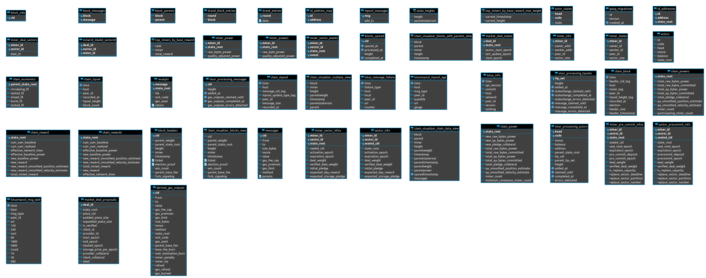

# filecoin-health-monitor

FIL Health Monitor, implemented in Plotly Dash.

## Using

Run locally through `python3 main.py` or access the deployed version at https://filecoin-health-monitor.herokuapp.com/.

Username: `file`, Password: `coin`

## Deploying

``
git push heroku
``

## Info

* Spreadsheet with the desired metrics
    * https://docs.google.com/spreadsheets/u/1/d/1zSSoDlH2KYxcw-13a3Wk4iObQEPXketDJ-4UwE3rKmg/edit?ouid=103579550194799631216&usp=sheets_home&ths=true

* Sentinel tables purpose (can be outdated)
    * https://github.com/filecoin-project/sentinel/blob/master/docs/sentinel_tables_purpose.csv

* Diagram for the Sentinel database
    * 